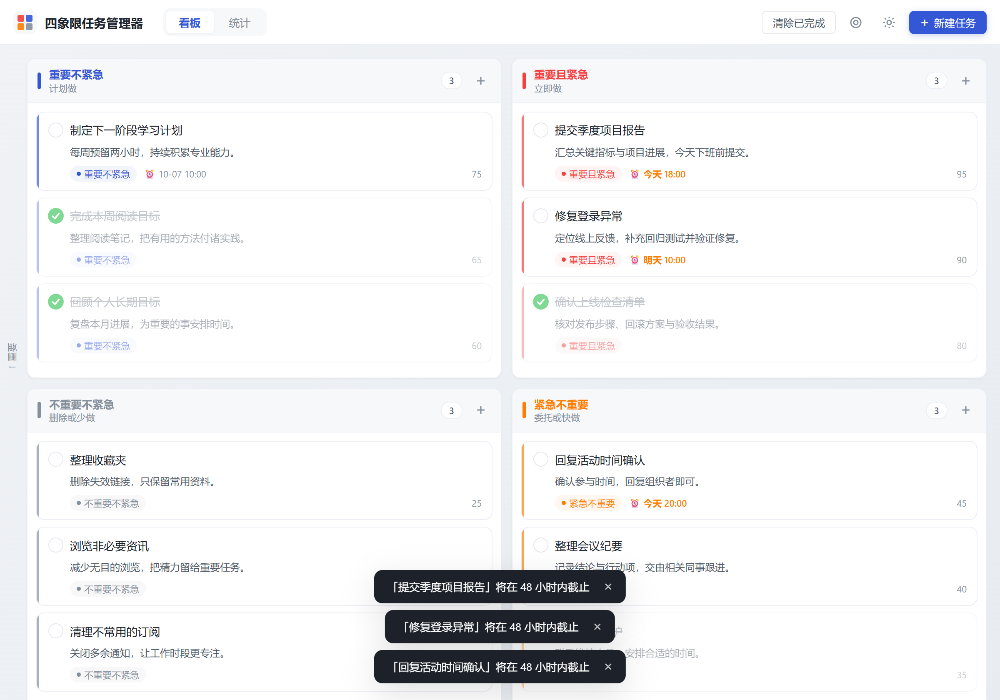
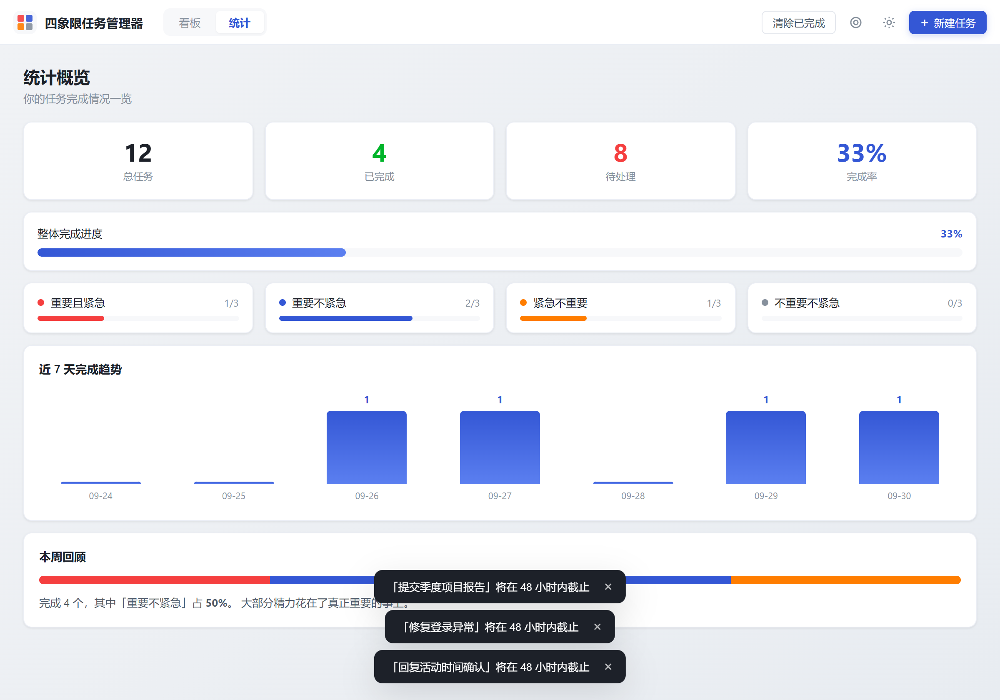

# 四象限任务管理器

> 基于艾森豪威尔矩阵的 AI 驱动桌面任务管理工具

[](https://github.com/BevalZ/Eisenhower-matrix/actions)
[](https://github.com/BevalZ/Eisenhower-matrix/releases)
[](https://github.com/BevalZ/Eisenhower-matrix/releases)
[](https://tauri.app)
[](https://vuejs.org)
[](https://www.rust-lang.org)
[](./LICENSE)

[界面预览](#界面预览) · [功能特性](#功能特性) · [下载安装](#下载安装) · [快捷键](#快捷键) · [配置](#配置) · [从源码构建](#从源码构建)

> *"The key is not to prioritize what's on your schedule, but to schedule your priorities."*
> — Stephen Covey

---

## 界面预览

### 四象限看板

按「重要性 × 紧急性」组织任务，在同一视图中查看任务描述、截止时间、优先级和完成状态。支持浅色与深色主题。

<picture>
  <source media="(prefers-color-scheme: dark)" srcset="docs/screenshots/board-dark.png">
  <source media="(prefers-color-scheme: light)" srcset="docs/screenshots/board-light.png">
  
</picture>

查看原图：[浅色看板](docs/screenshots/board-light.png) · [深色看板](docs/screenshots/board-dark.png)

<details>
<summary><strong>数据统计：完成进度、象限分布与近 7 天趋势（点击展开）</strong></summary>

统计页汇总总任务数、已完成、待处理和完成率，并通过各象限进度与本周回顾，帮助判断时间是否花在了重要的事上。



</details>

<details>
<summary><strong>任务创建向导：通过对话梳理重要性与截止时间（点击展开）</strong></summary>

先用一句话描述任务，再回答影响程度与完成时间，逐步明确任务优先级。

<p align="center">
  
</p>

> 图中未配置 API Key，因此保留了提示信息；AI 自动分类需先[配置 JevAI API Key](#jevai-api-key)，未配置时仍可手动选择象限。

</details>

*以上截图使用示例任务数据，不包含真实任务或凭据。*

## 功能特性

| 功能 | 说明 |
|------|------|
| 🤖 **AI 自动分类** | 对话式描述任务，JevAI 从重要性、紧急性两个维度评分，自动归入四象限并给出象限内优先级 |
| 📊 **四象限看板** | 拖拽跨象限移动和同象限排序（落点预览、平滑让位、边缘自动滚动、Esc 取消）；支持键盘操作 |
| ✏️ **快速录入与编辑** | 象限标题栏「+」只填标题即可添加；任务可随时编辑；删除和清除已完成都能撤销 |
| 🌗 **双主题** | 浅色 / 深色一键切换，自动记忆偏好 |
| 📈 **数据统计** | 完成率、各象限分布、近 7 天完成趋势 |
| 📤 **导入导出** | JSON 备份导出与导入恢复，跨设备迁移 |
| ☁️ **WebDAV 同步** | 多台设备通过任意 WebDAV 服务器（Nextcloud / ownCloud / 坚果云等）合并同步 |
| 🔁 **Tailscale 多端同步** | 同一 tailnet 内按任务直连合并，不经过额外服务器 |
| 💾 **本地存储** | SQLite 本地持久化，同步只发生在你自己的 Tailscale 网络 |
| ⚡ **轻量** | Tauri 构建，安装包 < 10 MB，启动秒开 |

## 四象限方法论

```
              重要 ↑
              ┌─────────────┬─────────────┐
              │  Q2        │  Q1        │
              │  重要不紧急  │  重要且紧急  │
              │  计划做      │  立即做      │
              ├─────────────┼─────────────┤
              │  Q4        │  Q3        │
              │  不重要不紧急 │  紧急不重要  │
              │  删除        │  委托/快做   │
              └─────────────┴─────────────┘
                    不紧急 ←——→ 紧急
```

| 象限 | 策略 | 典型任务 |
|------|------|----------|
| Q1 重要且紧急 | 立即做 | 截止日期、危机、紧急修复 |
| Q2 重要不紧急 | 计划做 | 长期目标、学习、健康、规划 |
| Q3 紧急不重要 | 委托/快做 | 临时打断、部分会议、杂事 |
| Q4 不重要不紧急 | 删除 | 无意义消磨、过度浏览 |

## 下载安装

前往 [Releases](../../releases) 页面下载对应平台的安装包：

| 平台 | 格式 | 文件名 |
|------|------|--------|
| Windows | NSIS 安装版 / 便携版 `.exe` | `Eisenhower Matrix_*_x64-setup.exe` / `*_x64_portable.exe` |
| macOS | `.dmg` | `Eisenhower-Matrix_*.dmg` |
| Linux | `.deb` / `.AppImage` | `eisenhower-matrix_*.deb` |
| Android | `.apk`（测试包见 Actions Artifacts） | `app-*-release.apk` / `app-*-debug.apk` |

> **macOS 提示**：首次打开若提示"无法验证开发者"，请到「系统设置 → 隐私与安全性」点击「仍要打开」。

## 从源码构建

### 前置要求

- **Rust** ≥ 1.90（Tauri 2.12 的要求，[rustup.rs](https://rustup.rs/)）
- **Node.js** ≥ 20
- **系统依赖**：
  - **Windows**: 安装 [WebView2 Runtime](https://developer.microsoft.com/microsoft-edge/webview2/)（Win10/11 通常已预装）
  - **macOS**: Xcode Command Line Tools（`xcode-select --install`）
  - **Linux**:
    ```bash
    # Ubuntu / Debian
    sudo apt install libwebkit2gtk-4.1-dev build-essential curl wget file \
      libxdo-dev libssl-dev libayatana-appindicator3-dev librsvg2-dev
    ```

### 构建步骤

```bash
# 克隆
git clone https://github.com/BevalZ/Eisenhower-matrix.git
cd Eisenhower-matrix

# 安装依赖
npm install

# 单元测试（前端 + Rust）
npm test
(cd src-tauri && cargo test)

# 开发模式
npm run tauri dev

# 构建安装包
npm run tauri build
```

构建产物位于 `src-tauri/target/release/bundle/`。

### 不在本地构建：用 GitHub Actions 出测试包

推送到 `main` 以外的任意分支，`Test Build` 工作流会先跑类型检查和单元测试，再打出 Windows 安装版和便携版，放在该次运行页面底部的 **Artifacts** 里（保留 14 天）。需要 macOS / Linux 包时，在 Actions 页面手动运行 `Test Build` 并勾选 “Also build macOS and Linux”。正式发布仍然是推送 `v*` tag 触发 `Release`。

### Android 端

Android 包同样完全在 GitHub Actions 上构建，本地不需要 Android SDK / NDK / JDK：

1. 推到 `main`、`feat/**` 分支，推送 `v*` tag，或在 Actions 页面手动运行 `Android` 工作流；
2. 运行结束后在 **Artifacts** 下载 `android-<sha>`，里面是 APK（配置了签名密钥时同时产出 AAB）；推送 tag 时还会自动附加到对应 Release。

| 情况 | 产物 | 用途 |
|------|------|------|
| 未配置签名密钥 | `*-debug.apk` | 调试签名，可直接安装测试 |
| 已配置签名密钥 | 已签名的 `*.apk` + `*.aab` | 长期分发 / 上架 Google Play |

#### 配置正式签名（可选）

在任意装有 JDK 的机器上生成上传密钥：

```bash
keytool -genkey -v -keystore upload-keystore.jks -keyalg RSA -keysize 2048 -validity 10000 -alias upload

# Linux / macOS：导出 base64
base64 -w0 upload-keystore.jks > keystore.b64
# Windows PowerShell
[Convert]::ToBase64String([IO.File]::ReadAllBytes("upload-keystore.jks")) | Set-Content keystore.b64
```

在仓库 **Settings → Secrets and variables → Actions** 添加四个 Secret：

| Secret | 内容 |
|--------|------|
| `ANDROID_KEY_BASE64` | `keystore.b64` 的全部内容（一行） |
| `ANDROID_KEY_ALIAS` | `upload` |
| `ANDROID_STORE_PASSWORD` | keystore 口令 |
| `ANDROID_KEY_PASSWORD` | 密钥口令（通常与上面相同） |

> keystore 与口令就是你的签名身份：泄露后别人可以签出被系统当作升级包安装的 APK。只放进 Secrets，不要提交进仓库。

#### 手机端与桌面端的差异

- **同步**：手机端没有 `tailscale` 命令，多端直连同步只在桌面端可用；手机请用 **WebDAV 同步**。
- **密钥存储**：Android 上没有系统凭据库，API Key / WebDAV 密码保存在应用私有目录的数据库里，设置页会明确提示「明文保存」。
- **悬浮球**：属于桌面窗口形态，手机端不显示。
- **触屏操作**：上下滑动列表 = 滚动；按住卡片约 0.26 秒后再拖动 = 移动 / 排序；点按卡片仍可编辑、切换完成。

## 快捷键

| 按键 | 作用 |
|------|------|
| `Ctrl/⌘ + N` | 新建任务（AI 向导） |
| `Esc` | 关闭弹窗；拖拽中取消拖拽 |
| 选中卡片后 `1`–`4` | 移到对应象限（Q1 重要且紧急 … Q4 不重要不紧急） |
| 选中卡片后 `Alt + ↑/↓` | 在象限内上下移动 |
| 选中卡片后 `Enter` / 双击 | 编辑 |
| 选中卡片后 `空格` / `Delete` | 切换完成 / 删除（可撤销） |

## 配置

### JevAI API Key

1. 打开应用，点击右上角 ⚙ 设置图标
2. 前往 [dashboard.typesafe.ai](https://dashboard.typesafe.ai) 获取 API Key
3. 在「常规」标签页粘贴并保存
4. 点击「+ 新建任务」，对话描述任务即可获得 AI 自动分类

> 未配置时仍可正常使用，AI 分类步骤可手动选择象限。

### WebDAV 同步

在「WebDAV 同步」标签页填入：
- **服务器地址**：完整的备份文件路径，如 `https://dav.example.com/eisenhower/backup.json`
- **用户名 / 密码**：WebDAV 凭证

点击「与 WebDAV 同步」：先下载远端文件，按任务逐条合并（规则同下文 Tailscale 同步），再把合并结果上传，多台设备轮流同步不会互相覆盖。首次同步时远端文件不存在也没关系。「用 WebDAV 覆盖本机」会丢弃本机任务、完全替换为远端版本，仅用于恢复；旧版本上传的备份文件同样能读取。

### Tailscale 多端同步

适合几台已经加入同一个 Tailscale 网络的电脑互相同步任务。连接只走 Tailscale 的 `100.64.0.0/10` 地址，不扫描局域网，也不上传到应用服务器。

1. 每台设备安装并登录同一个 tailnet。
2. 打开设置的「多端」页，填写**相同的同步密钥**和**相同的端口**（默认 `47321`）。
3. 两台设备都点击「开始接受同步」。应用会监听本机 Tailscale 地址，并大约每 45 秒与在线设备自动对齐；也可以手动同步某一台或全部在线设备。
4. Tailscale ACL 需要允许设备之间访问该 TCP 端口。macOS 首次监听时，系统可能会询问是否允许应用接受网络连接。

合并规则是按任务的修改时间后写覆盖；时间相同则用设备 ID 打破平局。删除会保留墓碑，所以删除也能同步到其他设备。API Key 和 WebDAV 密码不会同步。

如果两台设备在第一次同步前各自已经有任务，这些旧任务会各自生成 uid，可能变成重复项。可以先删掉多余任务，或者先用 JSON 导出，把其中一台的数据导入另一台，再开始同步。

## 项目结构

```
├── src/                      # 前端 Vue 3 + TypeScript
│   ├── components/           # UI 组件
│   │   ├── QuadrantBoard.vue # 四象限看板（拖拽、键盘移动、快速添加）
│   │   ├── TaskCard.vue      # 任务卡片
│   │   ├── TaskEditDialog.vue# 任务编辑
│   │   ├── TaskWizard.vue   # AI 对话创建
│   │   ├── StatsPanel.vue   # 统计面板
│   │   ├── ToastHost.vue    # 提示与撤销
│   │   └── SettingsDialog.vue# 设置管理
│   ├── composables/          # 状态与 Tauri 桥接（useTasks / useBoardDrag / useToast）
│   ├── ordering.ts           # 拖拽落点与排序（纯函数，有单元测试）
│   ├── App.vue
│   └── main.ts
├── src-tauri/                # Rust 后端
│   ├── src/
│   │   ├── lib.rs            # Tauri 命令注册
│   │   ├── models.rs        # 数据模型与象限计算
│   │   ├── db.rs             # SQLite 数据层
│   │   ├── jevai.rs          # TypeSafe AI 客户端
│   │   ├── webdav.rs         # WebDAV 客户端
│   │   ├── secrets.rs        # 系统凭据存储（API Key / WebDAV 密码）
│   │   └── sync.rs           # Tailscale 多端同步
│   ├── Cargo.toml
│   └── tauri.conf.json
├── .github/workflows/       # CI/CD 自动打包
├── docs/screenshots/        # README 界面截图（示例数据）
├── index.html
└── package.json
```

## 数据存储

| 平台 | 路径 |
|------|------|
| Linux | `~/.local/share/eisenhower-matrix/tasks.db` |
| macOS | `~/Library/Application Support/eisenhower-matrix/tasks.db` |
| Windows | `%APPDATA%\eisenhower-matrix\tasks.db` |

API Key 和 WebDAV 密码保存在系统凭据管理器（Windows 凭据管理器 / macOS 钥匙串 / Linux Secret Service），不写进数据库；系统凭据不可用时才回退到数据库。

> **隐私**：任务数据只存在本机和你自己的同步目标里。使用 AI 分类时，向导里填写的任务内容会发送给 TypeSafe AI；快速添加和手动选象限不联网。

## 技术栈

- **框架**: Tauri 2.0
- **前端**: Vue 3 + TypeScript + Vite
- **后端**: Rust
- **数据库**: SQLite (rusqlite, bundled)
- **AI**: TypeSafe AI JevAI (`jev-latest`)
- **HTTP**: reqwest

## 贡献

欢迎提交 Issue 和 Pull Request。

1. Fork 本仓库
2. 创建特性分支 (`git checkout -b feature/amazing`)
3. 提交更改 (`git commit -m 'Add amazing feature'`)
4. 推送到分支 (`git push origin feature/amazing`)
5. 开启 Pull Request

## 致谢

感谢 [LINUX DO](https://linux.do) 社区及各位佬友的支持。

## License

[MIT](./LICENSE)
